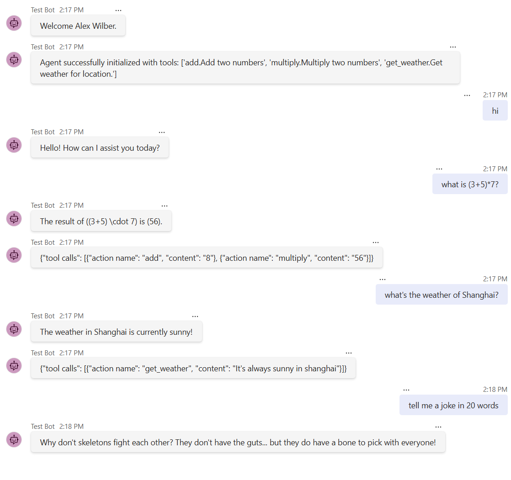

# Overview of the Teams MCP Agent template

It showcases how to build an AI agent in Teams capable of chatting with users using MCP servers to enable tools.

## Get started with the template

> **Prerequisites**
>
> To run the template in your local dev machine, you will need:
>
> - [Python](https://www.python.org/), version 3.8 to 3.11.
> - [Python extension](https://code.visualstudio.com/docs/languages/python), version v2024.0.1 or higher.
> - [Teams Toolkit Visual Studio Code Extension](https://aka.ms/teams-toolkit) latest version or [Teams Toolkit CLI](https://aka.ms/teams-toolkit-cli).
> - An account with [Azure OpenAI](https://aka.ms/oai/access).
> - A [Microsoft 365 account for development](https://docs.microsoft.com/microsoftteams/platform/toolkit/accounts).

### Configurations
1. Open the command box and enter `Python: Create Environment` to create and activate your desired virtual environment. Remember to select `src/requirements.txt` as dependencies to install when creating the virtual environment.
1. In file *env/.env.local.user*, fill in your Azure OpenAI key `SECRET_AZURE_OPENAI_API_KEY`, deployment name `AZURE_OPENAI_MODEL_DEPLOYMENT_NAME` and endpoint `AZURE_OPENAI_ENDPOINT`.
1. In file [./src/mcp_servers/mcp_servers_list.json](./src/mcp_servers/mcp_servers_list.json), replace `args` with the real full path of `XXX_server.py`

### Conversation with bot
1. Select the Teams Toolkit icon on the left in the VS Code toolbar.
1. In the Account section, sign in with your [Microsoft 365 account](https://docs.microsoft.com/microsoftteams/platform/toolkit/accounts) if you haven't already.
1. Press F5 to start debugging which launches your app in Teams using a web browser. Select `Debug in Teams (Edge)` or `Debug in Teams (Chrome)`.
1. When Teams launches in the browser, select the Add button in the dialog to install your app to Teams.
1. You will receive a welcome message from the bot, or send any message to get a response.

**Congratulations**! You are running an application that can now interact with users in Teams: When you are communicating with the agent, tool calling information will show if any tools are called.

> For local debugging using Teams Toolkit CLI, you need to do some extra steps described in [Set up your Teams Toolkit CLI for local debugging](https://aka.ms/teamsfx-cli-debugging).

## Known issue
- If you use `Debug in Test Tool` to local debug, you might get an error `InternalServiceError: connect ECONNREFUSED 127.0.0.1:3978` in Test Tool console log or error message `Error: Cannot connect to your app,
please make sure your app is running or restart your app` in log panel of Test Tool web page. You can wait for Python launch console ready and then refresh the front end web page.
- When you use `Launch Remote in Teams` to remote debug after deployment, you might loose interaction with your bot. This is because the remote service needs to restart. Please wait for several minutes to retry it.